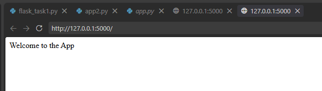
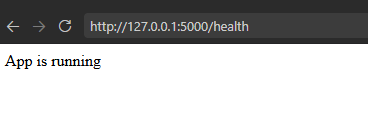
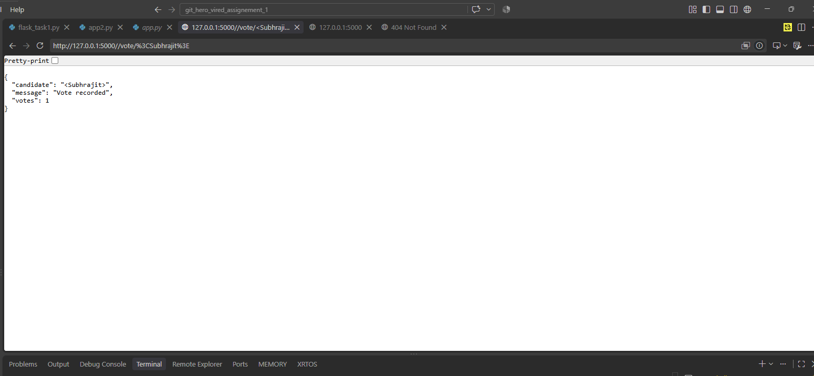
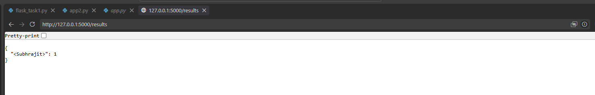
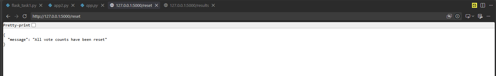
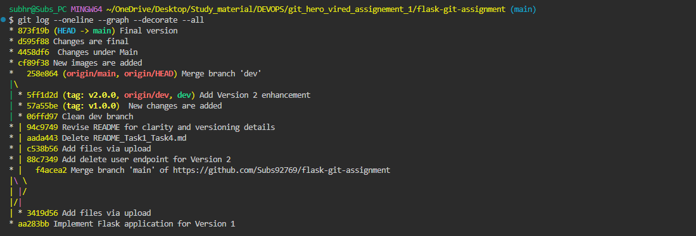
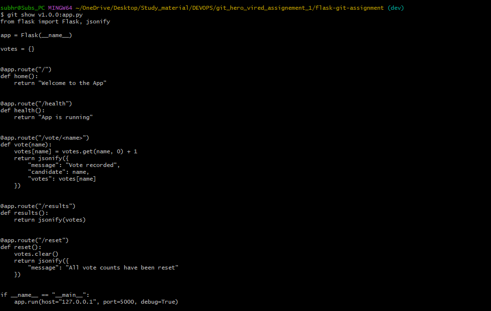

# Flask Voting Application with Git Versioning Workflow

## Project Description

Version 1 : It includes all the technical changes

This project is a simple voting application where users can cast a vote for a candidate and check the current voting results.  
It starts as a basic web application with a welcome page and a health-check page.  
The application is developed in stages using Git so that completed work is kept in stable versions.  

Version 2 adds only comments no functional changes

---

# Task 1: Basic Flask Application

## Objective

The first task was to create a Python application that runs a local web server with two working endpoints.

| Endpoint | Expected Response |
|---|---|
| `/` | `Welcome to the App` |
| `/health` | `App is running` |

The assignment specifies that these endpoints should be tested using:

```text
http://localhost:5000/
http://localhost:5000/health
```

Both endpoints should be accessible through a browser or Postman.

## Running the Application

Start the application using:

```bash
python app.py
```

Then open:

```text
http://localhost:5000/
```

and:

```text
http://localhost:5000/health
```

### Application Screenshot

The screenshot below shows the application running and a working endpoint.



### Health Endpoint Screenshot



---

# Task 2: Git Setup and Version 1 Release

## Objective

The second task was to set up Git version control and publish the Task 1 application to GitHub as Version 1.

The required workflow was:

1. Initialize a Git repository.
2. Create a branch named `dev` and switch to it.
3. Add the project files.
4. Commit the changes using a descriptive commit message.
5. Push the `dev` branch to GitHub.
6. Merge `dev` into `main`.
7. Push `main` to GitHub.

## Git Commands

Initialize Git:

```bash
git init
```

Create and switch to the development branch:

```bash
git checkout -b dev
```

Check the current status:

```bash
git status
```

Add the project files:

```bash
git add .
```

Commit the changes:

```bash
git commit -m "Add basic Flask application"
```

Push the development branch:

```bash
git push -u origin dev
```

Switch to the main branch:

```bash
git checkout main
```

Merge the completed development work:

```bash
git merge dev
```

Push the main branch:

```bash
git push -u origin main
```

The `main` branch contains the stable, working version of the application.

## Version 1

Version 1 contains the basic Flask application from Task 1 and its initial Git/GitHub release.

If a Version 1 tag was created, it can be displayed using:

```bash
git tag
```

and released with:

```bash
git tag v1.0
git push origin v1.0
```

---

# Task 3: Feature Implementation – Voting Application

## Objective

For Task 3, the **Voting Application (Option A)** was selected.

The application is an in-memory voting system. Users can cast a vote for a candidate by using the candidate's name in the URL, and the current standings can be viewed through the results endpoint.

The assignment requires:

- A `/vote/<name>` endpoint.
- A `/results` endpoint.
- Vote counts to be stored in a Python dictionary.
- Existing candidates to have their count increased when another vote is recorded.
- A new candidate to start with a vote count of 1.
- Results to be returned in JSON format.

## Voting Endpoint

### `POST /vote/<name>`

Records one vote for the candidate represented by `<name>`.

For example:

```text
POST /vote/Subhrajit
```

If the candidate is new, their count starts at 1. If the candidate already has votes, the count increases.

### Voter Added Screenshot



## Results Endpoint

### `GET /results`

Returns the current vote count for all candidates in JSON format.

Example:

```json
{
  "Subhrajit": 1
}
```

### Results Screenshot



---

# Task 4: Version 2 Enhancement

## Objective

The fourth task was to add one new endpoint to the existing voting application and release the enhancement as Version 2.

For the Voting Application, the required new endpoint is:

```text
/reset
```

The `/reset` endpoint clears all stored vote counts and returns a confirmation message.

After calling `/reset`, the `/results` endpoint should show no data.

## Reset Endpoint

### `POST /reset`

Example request:

```text
POST /reset
```

Example confirmation response:

```json
{
  "message": "Votes reset successfully"
}
```

The exact confirmation text should match the implementation in `app.py`.

### Reset Screenshot



## Version 2 Git Workflow

All Version 2 development must be completed on the `dev` branch rather than directly on `main`.

The workflow is:

```bash
git checkout dev
```

Make the `/reset` changes, then:

```bash
git add .
git commit -m "Add reset endpoint for voting application"
git push origin dev
```

Switch to `main`:

```bash
git checkout main
```

Merge the completed Version 2 feature:

```bash
git merge dev
```

Push the updated stable version:

```bash
git push origin main
```

If Version 2 is tagged:

```bash
git tag v2.0
git push origin v2.0
```

The Git history should show that Version 2 was built on top of Version 1 and that the new work was merged from `dev` into `main`.

---

# API Endpoint Reference

| Endpoint | URL | HTTP Method | What It Does | Example Response |
|---|---|---|---|---|
| Home | `/` | GET | Displays the welcome message. | `Welcome to the App` |
| Health | `/health` | GET | Confirms that the application is running. | `App is running` |
| Vote | `/vote/<name>` | GET* | Records one vote for the specified candidate. | Candidate vote count is increased. |
| Results | `/results` | GET | Returns the current vote count for all candidates in JSON format. | `{"Subhrajit": 1}` |
| Reset | `/reset` | GET* | Clears all stored vote counts and returns a confirmation message. | Reset confirmation message. |

> **Note:** The assignment explicitly describes the `/vote/<name>` and `/results` behaviors, and `/reset` is required for Version 2. Use the actual HTTP methods implemented in `app.py` when finalizing this table. If your Flask code does not explicitly specify `methods=[...]`, Flask's default method for a route is `GET`.

---

# Git Workflow

The project uses two branches:

- **`dev`** – used for development and feature changes.
- **`main`** – contains stable, completed, working code.

Development work is first completed and tested on `dev`. Once the feature is complete and working, `dev` is merged into `main`.

The same process is followed for each version.

## Version 1 Flow

```text
Create Flask Application
          |
          v
       dev branch
          |
          v
     Commit changes
          |
          v
      Push to GitHub
          |
          v
   Merge dev -> main
          |
          v
       Version 1
```

## Version 2 Flow

```text
       Version 1
          |
          v
       dev branch
          |
          v
    Add /reset feature
          |
          v
     Commit changes
          |
          v
      Push dev
          |
          v
   Merge dev -> main
          |
          v
       Version 2
```

This workflow keeps `main` stable while new development is performed on `dev`.

---

# Version History

| Version | Included Features |
|---|---|
| **Version 1.0** | Basic Flask application with `/` and `/health` endpoints, Git repository setup, `dev` branch, merge into `main`, and GitHub release. |
| **Version 2.0** | Added the `/reset` endpoint for the Voting Application. The feature was developed on `dev`, committed, pushed, merged into `main`, and released as Version 2. |

---

# Screenshots

## 1. Application Running in Browser

The assignment requires a screenshot showing the application running in a browser with at least one working endpoint.


## 2. GitHub Repository Showing `dev` and `main`

Add the screenshot of the GitHub repository page showing both branches.

Save the screenshot in the project as:



Then it will be displayed here:




## 3. Commit/Merge History Showing Version 1 and Version 2

Add the screenshot showing the commit or merge history for Version 1 and Version 2.

Save the screenshot in the project as:


# Installation and Setup

Follow these steps to download and run the application.

## Step 1: Install Python

Check that Python 3.x is installed:

```bash
python --version
```

## Step 2: Install Flask

Install Flask:

```bash
pip install flask
```

## Step 3: Clone the GitHub Repository

Clone the repository:

```bash
git clone <YOUR-GITHUB-REPOSITORY-URL>
```

Move into the project folder:

```bash
cd <YOUR-PROJECT-FOLDER>
```

## Step 4: Run the Application

Start the Flask application:

```bash
python app.py
```

## Step 5: Open the Application

Open the following URL in a browser:

```text
http://localhost:5000/
```

Health check:

```text
http://localhost:5000/health
```

Voting example:

```text
http://localhost:5000/vote/Subhrajit
```

Results:

```text
http://localhost:5000/results
```

Reset:

```text
http://localhost:5000/reset
```

> For `/vote/<name>` and `/reset`, use the HTTP method required by the implementation in `app.py`.

---

# Project Structure

```text
git_hero_vired_assignement_1/
│
├── app.py
├── README.md
└── screenshots_new/
    ├── Screenshot1_welcome_to_app.png
    ├── Screenshot_2_app_is_running.png
    ├── Screenshot_3_voter_added.png
    ├── Screenshot_4_results.png
    ├── Screenshot5_reset.png
    ├── github_branches.png
    └── git_history_versions.png
```

---

# Assignment Checklist

- [x] Task 1 – Basic Flask Application
- [x] Task 2 – Git Setup and Version 1 Release
- [x] Task 3 – Voting Application Feature Implementation
- [x] Task 4 – `/reset` Version 2 Enhancement
- [x] Installation and setup documentation
- [x] API endpoint reference
- [x] Git `dev` and `main` workflow documentation
- [x] Version history
- [x] Application screenshot
- [x] GitHub screenshot showing both `dev` and `main`
- [x] Commit/merge history screenshot showing Version 1 and Version 2

